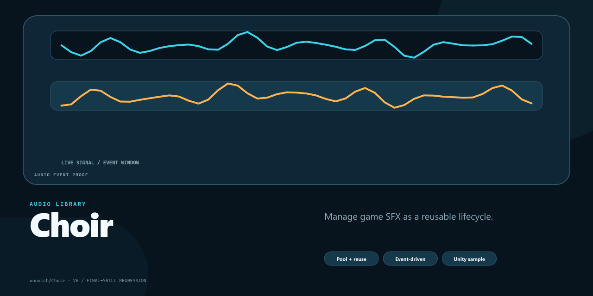

# Choir

[简体中文](README.zh-CN.md)

Choir is a lightweight Unity audio lifecycle library for background music, ambience, and pooled one-shot sound effects.



## What Choir does

- Creates individually controlled audio players for music and ambience.
- Creates named player groups for reusable sound-effect playback.
- Plays a group sound only when a player is free, limiting simultaneous overlap.
- Controls play, pause, resume, stop, volume, and mute state.
- Supports clip replacement and easing-based fade transitions through Swing.

## Installation

Choir depends on [Swing](https://github.com/onovich/Swing). Add Swing first:

```text
https://github.com/onovich/Swing.git?path=/Assets/com.mortise.swing#main
```

Then add Choir through **Window → Package Manager → Add package from git URL**:

```text
https://github.com/onovich/Choir.git?path=/Assets/com.tenon.choir#main
```

The package metadata declares Unity `2019.4` or later. The included project uses Unity `2023.2.22f1`.

## Quick start

```csharp
using TenonKit.Choir;
using UnityEngine;

public sealed class AudioSample : MonoBehaviour {
    [SerializeField] Transform soundRoot;
    [SerializeField] AudioClip backgroundMusic;
    [SerializeField] AudioClip clickSound;

    SoundCore soundCore;
    int musicId;

    void Start() {
        soundCore = new SoundCore(soundRoot, 5);

        musicId = soundCore.CreateSoundPlayer(
            autoPlay: true,
            isLoop: true,
            name: "BGM",
            clip: backgroundMusic
        );

        soundCore.CreateSoundPlayerGroup(
            autoPlay: false,
            capacity: 4,
            groupName: "UI"
        );
    }

    public void PlayClick() {
        soundCore.PlayInGroupIfFree("UI", clickSound);
    }

    void Update() {
        soundCore.Tick(Time.deltaTime);
    }

    void OnDestroy() {
        soundCore?.TearDown();
    }
}
```

## Status

Single players, player groups, free-player playback, basic transport controls, volume, mute, and fades are implemented. Queued “play when free” behavior, loop/random groups, spatial audio, and mixer or reverb support are not implemented.

The current package version is `0.0.6`. Choir is intended for small projects, demos, and game jams rather than as a complete replacement for a production audio middleware stack. The repository has no automated tests.

## Development

Runtime code lives in `Assets/com.tenon.choir/Scripts_Runtime/`; sample scenes and scripts live beside it under the package folder.

## License

[MIT](LICENSE)
